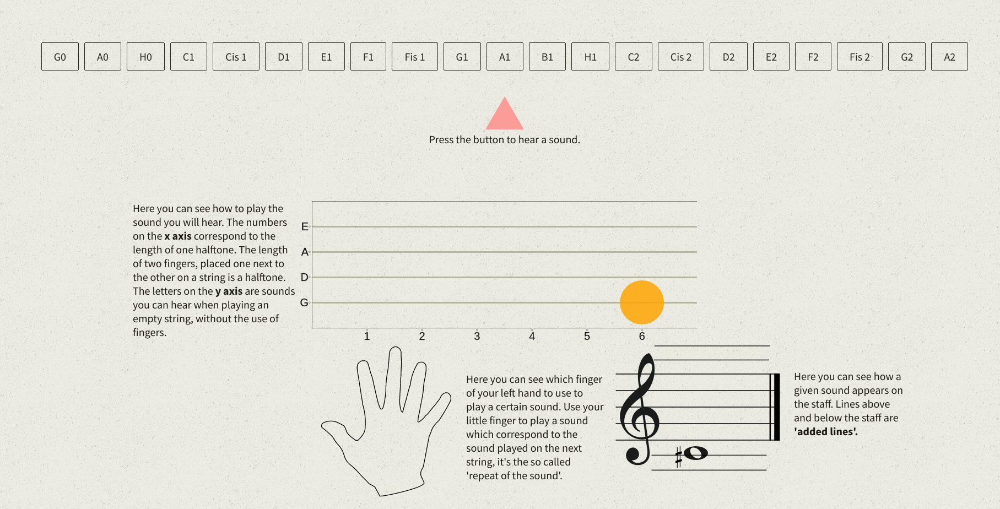

# Getting Started

Execute the following command on your terminal to install all the needed packages and run the application:
```sh
$ npm i
$ npm run dev
```
The application will start automatically in your browser on http://localhost:9000

# Tools

* React
* Sass
* Canvas
* Webpack
* React-easy chart
    
# Screenshots



    
